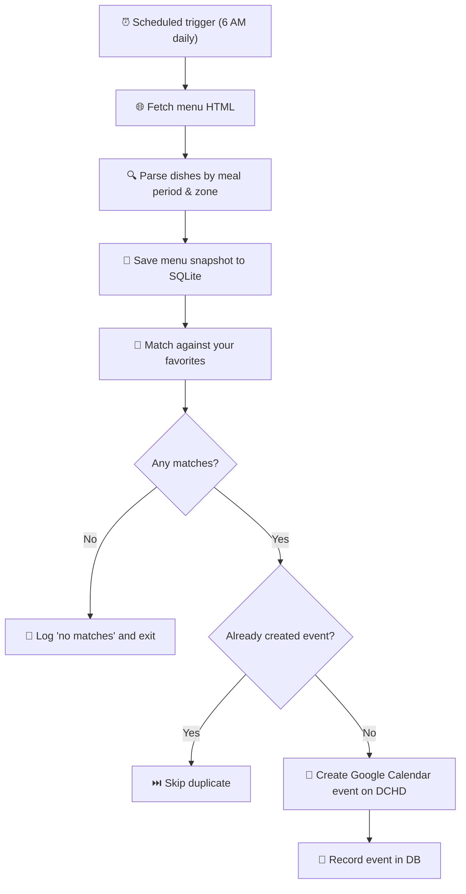

# Aggie Meal Notifier — Overview & Tutorial

## What It Does

You tell the app which UC Davis dining hall meals you love. Every day, it checks the menu, and if your favorites show up, it automatically creates a Google Calendar event at the right meal time — so you never miss Mongolian BBQ again.

Events go to a shared **DCHD** calendar that anyone can subscribe to via URL.

---

## How It Works (Pipeline)



---

## File Map

| File | Role |
|---|---|
| `app/main.py` | **Entry point** — runs the full pipeline |
| `app/fetch_menu.py` | Fetches HTML from UC Davis dining pages (3 retries) |
| `app/parse_menu.py` | Extracts dishes from HTML (`h2` → meal period, `h3` → zone, `h4` → dish) |
| `app/normalize.py` | Cleans dish names: lowercase, strip punctuation, remove `\|\|` suffixes |
| `app/matcher.py` | Loads favorites, compares using **substring matching** |
| `app/calendar_client.py` | Google Calendar OAuth + event creation on the shared DCHD calendar |
| `app/db.py` | SQLite: stores menu history, favorites, and created events (dedup) |
| `config/favorites.json` | **Your favorite meals** — edit this! |
| `config/settings.json` | Meal times, dining commons URLs, timezone, DCHD calendar ID |
| `DCHD_daily.sh` | Shell wrapper for scheduled runs |
| `com.aggiemeal.notifier.plist` | macOS launchd config (daily at 6 AM) |

---

## Quick Tutorial

### 1. Edit your favorites

```bash
# Open the favorites file
open config/favorites.json
```

Add any meals you want to track. Matching is **case-insensitive** and uses **substring matching**:

```json
[
    "Tri Tip",
    "Build Your Own Burger",
    "Mongolian BBQ"
]
```

> [!TIP]
> `"Mongolian BBQ"` will match `"BYO Mongolian BBQ"`, `"BYO Veggie Mongolian BBQ"`, etc.

### 2. Run manually

```bash
cd /Users/yangshuoning/Desktop/personal\ coding\ projects/aggie-meal-notifier
source venv/bin/activate
python app/main.py
```

You'll see output like:

```
============================================================
Aggie Meal Notifier — starting daily run
============================================================
Tracking 3 favorites: ['Tri Tip', 'Build Your Own Burger', 'Mongolian BBQ']

--- Tercero Dining Commons ---
Fetching menu from https://housing.ucdavis.edu/dining/menus/dining-commons/tercero/
Parsed 409 menu items
Saved 244 new items to database
🎉 Found 4 match(es) at Tercero!
  ✅ Created event: BYO Mongolian BBQ (Lunch, Tercero)
  ✅ Created event: BYO Veggie Mongolian BBQ (Lunch, Tercero)

--- Segundo Dining Commons ---
...

============================================================
DAILY RUN SUMMARY
============================================================
  Menu items parsed:     800+
  Favorite matches:      6
  Calendar events created: 6
  Duplicates skipped:    0
============================================================
```

### 3. Check your calendar

The events appear on the **DCHD** calendar in Google Calendar with:
- 🍽️ Title: `"🍽️ BYO Mongolian BBQ — Tercero DC"`
- ⏰ Time: the meal period window (e.g. Lunch 11am–2pm)
- 📍 Location: `"Tercero Dining Commons, UC Davis"`
- 🔔 Reminder: 30 minutes before

### 4. Share with friends

Others can subscribe to your DCHD calendar:
- **Google Calendar**: Settings → Add calendar → From URL → paste the iCal URL
- **Apple Calendar**: File → New Calendar Subscription → paste the iCal URL

### 5. Add/remove dining commons

Edit `config/settings.json`:

```json
{
    "dining_commons": {
        "Tercero": "https://housing.ucdavis.edu/dining/menus/dining-commons/tercero/",
        "Segundo": "https://housing.ucdavis.edu/dining/menus/dining-commons/segundo/"
    }
}
```

### 6. Automated daily runs

Already set up! The launchd job runs at 6 AM. Check status with:

```bash
launchctl list | grep aggiemeal
```

### 7. Debugging

```bash
cat logs/app.log              # Main pipeline log
cat logs/launchd_stdout.log   # Scheduled run output
cat logs/cron.log             # Run completion timestamps
```

---

## Key Design Decisions

| Decision | Rationale |
|---|---|
| **Substring matching** instead of exact | Dining hall dishes often have prefixes like "BYO" or suffixes like "(GF)" |
| **Dedicated DCHD calendar** | Keeps meal alerts separate from your personal calendar; shareable via URL |
| **SQLite for dedup** | Simple, no external DB needed; `UNIQUE` constraints prevent duplicates at the schema level |
| **Retry on fetch** | University servers can be flaky; 3 attempts with 5s delay |
| **6 AM schedule** | Menus are typically posted overnight; early morning catch gives time for reminders |
